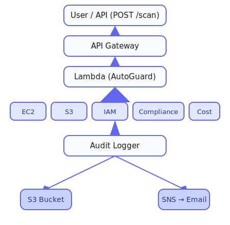

# 🚨 AutoGuard: AWS Lambda Security Scanner & Auto-Remediation

**AutoGuard** is a serverless AWS security and compliance tool that scans your cloud resources for misconfigurations, compliance gaps, and cost anomalies. It automatically detects and remediates common issues, sending you alerts and reports—all powered by AWS Lambda for zero-ops, always-on security.

---

## 🌟 Features

* **Multi-Resource Scanning**: Checks EC2, S3, IAM, compliance, and cost.
* **Auto-Remediation**: Automatically fixes common security/config issues.
* **Modular Handlers**: Easily extend with your own resource handlers.
* **Audit Logging & Reporting**: All actions and findings are logged for compliance and sent as detailed email reports via SNS.
* **Cloud Native**: Deploys quickly with CloudFormation.
* **Cost Awareness**: Built-in cost scan/handler to identify waste.

---

## 🛠️ How It Works

There are **two ways to deploy and use AutoGuard**:

### 1. Using the Zip File (Manual Setup)

* Download or build `Autoguard.zip`, which contains all dependencies and code.
* Upload this ZIP as a new AWS Lambda function via the AWS Console.
* **Manually** set up:

  * API Gateway endpoints
  * SNS notification topics/subscriptions
  * Lambda environment variables
  * IAM roles and permissions
* This is good for testing or customizing code, but **requires manual AWS resource configuration**.

### 2. Using the CloudFormation Template (Recommended)

* Use the provided `Cloudfront.yml` CloudFormation template.
* **Automatically creates and connects:**

  * Lambda function
  * API Gateway (with all stages and endpoints)
  * SNS topics and subscriptions (for email reporting)
  * Audit logs S3 bucket
  * Environment variables, IAM roles, permissions
  * All other required AWS infrastructure
* **Best for production and quick, error-free setup.**

---

## 🚦 Triggering a Scan & Usage Limitations

* **Scans are only triggered by sending a POST request to the `/scan` API endpoint.**
* **You must use a REST client like Postman or cURL**. Triggering via a browser is not supported.
* When you trigger a scan, the HTTP response will typically show a **timeout error**. This is expected for long-running Lambda functions and does **not** mean the scan failed.
* **Results and detailed scan reports are sent to your configured email via SNS, not via the HTTP response.**

**Example:**

```sh
curl -X POST https://your-api-id.execute-api.region.amazonaws.com/prod/scan
```

---

## 🖼️ Deployment & Architecture Diagram

```plaintext
+--------------------------+
| User / API (POST /scan)  |
+-----------+--------------+
            |
            v
     +-------------+
     | API Gateway |
     +-------------+
            |
            v
  +---------------------+
  | Lambda (AutoGuard)  |
  +---------------------+
            |
  +---------+---------+---------+--------+--------+
  |         |         |         |        |        |
[EC2]     [S3]     [IAM]  [Compliance] [Cost]
            |
            v
     +---------------------+
     |    Audit Logger     |
     +---------------------+
        |             |
        v             v
   S3 Bucket     SNS → Email
```

**How it works:**
When AutoGuard is triggered by a POST API call, API Gateway routes the request to Lambda. Lambda uses modular handlers to scan AWS resources, attempts auto-remediation, logs results, and sends a detailed report to your email via SNS.
All infrastructure is created automatically with the CloudFormation template.

---

## 🧩 CloudFormation Stack Logic

When you deploy AutoGuard using the provided `Cloudfront.yml` CloudFormation template, **all necessary AWS resources are created and connected automatically**. Here’s how it works:

### What Gets Created

* **API Gateway Endpoint**
  Exposes a REST API endpoint (`/scan`) for triggering the Lambda scan.
* **Lambda Function**
  The core of AutoGuard for scanning, remediation, logging, and notifications.
* **SNS Topic and Email Subscription**
  For sending detailed reports to your provided email.
* **Audit Logs S3 Bucket**
  Stores audit logs of every scan and remediation.
* **IAM Role and Permissions**
  Grants Lambda access to necessary AWS services.

### CloudFormation Component Flow




### CloudFormation Highlights

* **AWSTemplateFormatVersion:** Uses the standard CloudFormation version for AWS resources.
* **Parameters:** Accepts your email address (`UserEmail`) for report delivery.
* **Resources Created:**

  * SNS topic and email subscription for notifications
  * Audit S3 bucket for logs
  * IAM role and policies for Lambda execution
  * Lambda function with environment variables for SNS and S3
  * API Gateway with `/scan` endpoint (POST method)
  * Permissions for API Gateway to invoke Lambda
  * Automatic deployment of the API to a production stage

### Outputs

After stack creation, CloudFormation outputs:

* The `/scan` API endpoint URL for triggering scans
* Lambda function name
* SNS Topic ARN (for notifications)
* Audit S3 bucket name

**This stack ensures you have a ready-to-use, fully connected scanning system with a single deployment command and minimal setup.**

---

## 🗂️ Project Structure

```
autoguard-aws_lambda_app/
├── audit/
│   └── logger.py
├── autoguard/
│   ├── __init__.py
│   ├── config.py
│   ├── fixer.py
│   ├── reporter.py
│   └── scanner.py
├── handlers/
│   ├── compliance_handler.py
│   ├── cost_handler.py
│   ├── ec2_handler.py
│   ├── iam_handler.py
│   └── s3_handler.py
├── integrations/
│   ├── slack_notifier.py         # (Planned/future)
│   └── webhook_notifier.py       # (Planned/future)
├── .env
├── Autoguard.zip
├── Cloudfront.yml
├── lambda_handler.py
├── requirements.txt
└── README.md
```

---

## ✅ What Was Achieved

* Core Lambda function to scan EC2, S3, IAM, compliance, and cost.
* Modular handler system for easy extensibility.
* Working auto-remediation for common security issues (S3, IAM).
* Audit logging and reporting using SNS (email).
* Automated deployment with CloudFormation.

---

## 💡 Plans & Ideas To Achieve

| Feature/Idea                                                                                      | Achieved    |
| ------------------------------------------------------------------------------------------------- | ----------- |
| Core AWS resource scanning (EC2, S3, IAM, cost, compliance)                                       | ✅           |
| Modular handler architecture                                                                      | ✅           |
| Auto-remediation for common issues                                                                | ✅           |
| Audit logging and reporting with email via SNS                                                    | ✅           |
| Automated deployment with CloudFormation                                                          | ✅           |
| Static webpage: explaining the solution and assisting with direct AWS scans                       | ❌           |
| UI/UX for the scan trigger (web or minimal interface)                                             | ❌           |
| Automating CloudFormation deployment with little/no manual interaction                            | ❌           |
| Enhanced security and compliance checks (full CIS coverage, custom rules, etc.)                   | ❌ (partial) |
| SNS template modification: include a detailed web report (e.g., unverified IPs, unused IAM, etc.) | ❌           |
| Web-based dashboard for extended reporting                                                        | ❌           |
| Multi-account and AWS Organization-wide scanning                                                  | ❌           |
| AI integration: advanced security monitoring & auto-scaling/reactive actions                      | ❌           |
| Slack and webhook alert integrations                                                              | ❌           |
| Built-in scheduler (CloudWatch Events trigger)                                                    | ❌           |
| Can trigger scan via browser                                                                      | ❌           |
| Can trigger scan via REST client (Postman/cURL)                                                   | ✅           |
| Immediate HTTP scan results in response                                                           | ❌           |
| Results/reports delivered by email (SNS)                                                          | ✅           |

---

### Notes

* **Slack and webhook alert integrations**: Not yet implemented due to time constraints.
* **Web UI/UX, dashboard, advanced compliance and AI features**: Planned for future work.
* **Built-in scheduling via CloudWatch Events**: Not available in current release.
* **API endpoint cannot be triggered via browser, only via REST client.**

---

## 🏗️ Original Plan vs. Final Implementation

* **Original Plan:**
  Support for all major AWS services, web-based dashboard, multi-account scanning, advanced compliance frameworks, extensive integrations, AI-driven security monitoring, and minimal setup friction.
* **Final Implementation:**
  Focused on core resource types (EC2, S3, IAM), modularity, production-ready remediation for the most critical findings, and reliable, serverless deployment with email reporting.

---
